```mermaid
graph TB
    subgraph Client["🌐 Client Layer"]
        Browser["Web Browser<br/>(Chrome, Firefox, Safari, Edge)"]
        Mobile["📱 Mobile Browser<br/>(Responsive Design)"]
    end

    subgraph Frontend["⚛️ Frontend Layer (React 19 + TypeScript)"]
        subgraph UI["UI Components"]
            Landing["🏠 Landing Page<br/>(Multilingual i18n)"]
            Dashboard["📊 Dashboard"]
            MoodRec["😊 Mood Recommender"]
            MealLog["🍽️ Meal Logger"]
            BMICalc["📏 BMI Calculator"]
            Gamification["🏆 Gamification"]
            History["📜 Meal History"]
            Analytics["📈 Analytics"]
            Barcode["📷 Barcode Scanner<br/>(@zxing)"]
        end
        
        subgraph State["State Management"]
            Hooks["React Hooks<br/>(useState, useEffect)"]
            Context["Context API<br/>(if needed)"]
        end
        
        subgraph Assets["Static Assets"]
            Styles["Tailwind CSS<br/>(Utility-first)"]
            Icons["React Icons<br/>(UI Icons)"]
            Images["Unsplash Images<br/>(CDN)"]
        end
        
        Vite["⚡ Vite 7.1<br/>(Build Tool)"]
    end

    subgraph Network["🌐 Network Layer"]
        HTTP["HTTPS/TLS 1.2+<br/>(Encrypted)"]
        CORS["CORS Config<br/>(Same-origin Policy)"]
        APIClient["Fetch/axios<br/>(HTTP Client)"]
    end

    subgraph Backend["🐍 Backend Layer (FastAPI 0.111)"]
        subgraph Routes["API Routes"]
            Auth["🔐 Auth Endpoints<br/>/register, /login"]
            Meals["🍲 Meal Endpoints<br/>/meals (CRUD)"]
            BMI["📊 BMI Endpoints<br/>/bmi"]
            AI["🤖 AI Endpoints<br/>/ai/recommend-*"]
            Utils["🔧 Utility Endpoints<br/>/health, /dishes"]
            Translate["🌍 Translation<br/>/translate"]
        end
        
        subgraph Services["Business Logic Services"]
            AuthSvc["Authentication<br/>(JWT, bcrypt)"]
            MoodSvc["Mood Recommender<br/>(5 moods scoring)"]
            ThaliSvc["Thali Recommender<br/>(Traditional meals)"]
            CalorieSvc["Calorie Calculator<br/>(Nutritional AI)"]
            AlertSvc["Alert Service<br/>(Notifications)"]
        end
        
        subgraph DataAccess["Data Access Layer"]
            SQLAlchemy["SQLAlchemy ORM<br/>(2.0.32)"]
            Models["Models<br/>(User, Meal, BMI)"]
            Queries["Query Builder"]
        end
        
        Uvicorn["🚀 Uvicorn Server<br/>(Port 8000)"]
    end

    subgraph Database["🗄️ Database Layer (PostgreSQL 12+)"]
        subgraph Schema["Database Schema"]
            UsersTable["👤 users<br/>(id, email, password_hash...)"]
            MealsTable["🍽️ meals<br/>(id, user_id, calories...)"]
            BMITable["📊 bmi_records<br/>(id, user_id, bmi_value...)"]
            AchievementsTable["🏅 achievements<br/>(id, user_id, badge...)"]
            PreferencesTable["⚙️ preferences<br/>(id, user_id, language...)"]
        end
        
        subgraph Migrations["Database Migrations"]
            Alembic["Alembic 1.13.2<br/>(Schema Versioning)"]
        end
        
        subgraph Optimization["Query Optimization"]
            Indices["Indices<br/>(user_id, email, timestamp)"]
            Connections["Connection Pooling<br/>(psycopg-binary)"]
        end
    end

    subgraph ExternalServices["☁️ External Services"]
        GoogleTranslate["🌐 Google Cloud Translate<br/>(Optional Translation API)"]
        Barcode["🔍 Barcode Lookup<br/>(Product Database)"]
        Unsplash["📸 Unsplash API<br/>(Food Images)"]
    end

    subgraph Security["🔒 Security Layer"]
        JWT["JWT Tokens<br/>(24hr expiration)"]
        Bcrypt["bcrypt Password<br/>(Salt + Hash)"]
        InputVal["Input Validation<br/>(Pydantic)"]
        HTTPS["HTTPS/TLS<br/>(Encryption)"]
    end

    subgraph Deployment["🚀 Deployment"]
        Docker["🐳 Docker<br/>(Frontend & Backend)"]
        Monitoring["📡 Monitoring<br/>(Logs, Metrics)"]
        ErrorHandle["⚠️ Error Handling<br/>(Sentry, Logging)"]
    end

    %% Connections
    Browser -->|HTTP/HTTPS| Vite
    Mobile -->|HTTP/HTTPS| Vite
    
    Vite -->|React Build| Frontend
    UI -->|Uses| Hooks
    UI -->|Uses| Context
    UI -->|Styled with| Styles
    UI -->|Icons from| Icons
    UI -->|Images from| Images
    
    Frontend -->|API Calls| APIClient
    APIClient -->|HTTPS| HTTP
    HTTP -->|CORS Check| CORS
    CORS -->|Routes to| Uvicorn
    
    Uvicorn -->|Processes| Routes
    Routes -->|Uses| Services
    Services -->|Data Access| DataAccess
    
    Auth -->|Validates| AuthSvc
    AuthSvc -->|Hashes with| Bcrypt
    AuthSvc -->|Creates| JWT
    
    Meals -->|Calculates| CalorieSvc
    AI -->|Scores| MoodSvc
    AI -->|Suggests| ThaliSvc
    Utils -->|Provides| AlertSvc
    
    DataAccess -->|ORM Queries| SQLAlchemy
    SQLAlchemy -->|Maps to| Models
    Models -->|Query| Queries
    
    Queries -->|JDBC| Schema
    Schema -->|Tables| UsersTable
    Schema -->|Tables| MealsTable
    Schema -->|Tables| BMITable
    Schema -->|Tables| AchievementsTable
    Schema -->|Tables| PreferencesTable
    
    Alembic -->|Manages| Migrations
    Migrations -->|Applied to| Schema
    
    Schema -->|Optimized by| Indices
    Schema -->|Connected via| Connections
    
    Services -->|External Call| GoogleTranslate
    Services -->|Lookup| Barcode
    Frontend -->|CDN Load| Unsplash
    
    AuthSvc -->|Uses| JWT
    AuthSvc -->|Uses| InputVal
    Routes -->|Validates| InputVal
    Frontend -->|Encrypts| HTTPS
    Backend -->|Encrypts| HTTPS
    
    Docker -->|Containerizes| Frontend
    Docker -->|Containerizes| Backend
    Monitoring -->|Tracks| Uvicorn
    ErrorHandle -->|Catches| Services
    
    style Client fill:#e1f5ff
    style Frontend fill:#f3e5f5
    style Network fill:#fff3e0
    style Backend fill:#e8f5e9
    style Database fill:#fce4ec
    style ExternalServices fill:#fff9c4
    style Security fill:#ffebee
    style Deployment fill:#f1f8e9
```

---

## 📊 System Architecture Diagram Legend

### **Frontend (React 19 + TypeScript)**
- Single Page Application (SPA) with component-based architecture
- Responsive design for mobile, tablet, desktop
- Tailwind CSS for styling
- Vite for fast build and dev server

### **Network Layer**
- HTTPS/TLS encryption for all communications
- CORS policy enforcement
- Fetch API for HTTP requests

### **Backend (FastAPI)**
- RESTful API with organized routes
- Business logic services (Mood, Thali, Calorie recommendations)
- Data access layer using SQLAlchemy ORM
- Uvicorn ASGI server on port 8000

### **Database (PostgreSQL)**
- Normalized relational schema
- Connection pooling for scalability
- Alembic migrations for version control
- Indices for query optimization

### **External Services**
- Google Cloud Translate for multilingual support
- Barcode APIs for product lookup
- Unsplash for food images

### **Security**
- JWT tokens for stateless authentication
- bcrypt for password hashing
- Input validation with Pydantic
- HTTPS for data encryption

### **Deployment**
- Docker containerization
- Monitoring and logging
- Error handling and tracking

---

## 🔄 Key Data Flows

### 1. **User Login Flow**
```
Browser → React Form → Fetch /login → FastAPI Auth Service 
→ Validate Credentials → Hash Check (bcrypt) → Generate JWT Token 
→ Return Token → Store in Browser Storage → Next Requests with JWT
```

### 2. **Meal Logging Flow**
```
User Input → React Form → Fetch /meals (POST) → FastAPI Meals Route 
→ Calorie Calculator Service → Parse Nutrition Data 
→ SQLAlchemy ORM → Insert into meals table → PostgreSQL 
→ Calculate Daily Total → Return Updated Stats → React Update UI
```

### 3. **Mood Recommendation Flow**
```
User Selects Mood → React Component → Fetch /ai/recommend-mood 
→ FastAPI Route → Mood Recommender Service 
→ Multi-criteria Scoring Algorithm → Query dishes database 
→ SQLAlchemy ORM → PostgreSQL Query → Score Results 
→ Filter Top 5 → Generate Insights → Return JSON 
→ React Displays Results
```

### 4. **Translation Flow**
```
Language Change → React State Update → Fetch /translate 
→ FastAPI Translation Route → Google Cloud Translate API Call 
→ Get Translated Strings (or Fallback to Built-in) 
→ Return Translations → React Updates UI Text
```

---

## 📈 Scaling Architecture (Future)

```
Load Balancer (Nginx/HAProxy)
    ↓
    ├─ Backend Pod 1 (FastAPI)
    ├─ Backend Pod 2 (FastAPI)
    └─ Backend Pod 3 (FastAPI)
    
All connect to:
    ├─ PostgreSQL (Primary) + Read Replicas
    ├─ Redis Cache (Session + Data)
    └─ Message Queue (Celery for background jobs)
```

